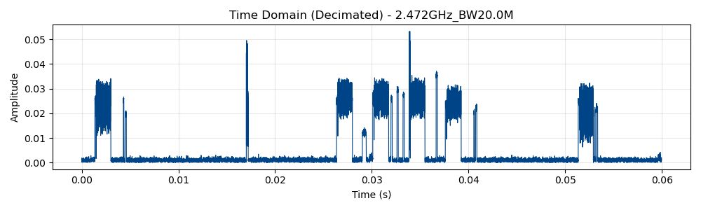
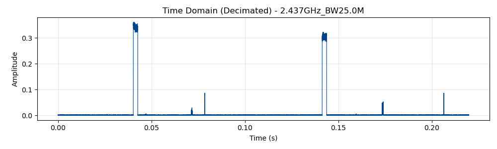

# Analysis of Wireless Signal Characteristics in the 2.4 GHz ISM Band

**Abstract**—This project explores the acquisition and analysis of radio frequency (RF) signals using Software Defined Radio (SDR). We utilize Python-based signal processing techniques to capture Time Domain data and generate Spectrograms. The analysis focuses on signal bursts and frequency occupancy at center frequencies of 2.437 GHz and 2.472 GHz.

## I. INTRODUCTION
The 2.4 GHz Industrial, Scientific, and Medical (ISM) band is heavily utilized by various communication protocols, including Wi-Fi (IEEE 802.11) and Bluetooth. Analyzing these signals in the time and frequency domains provides insight into channel utilization, beacon periodicity, and interference patterns. This report presents the visual results of signal capturing and decimation processes.

## II. METHODOLOGY
The system setup involves a Universal Software Radio Peripheral (USRP) for signal acquisition. The captured IQ samples are processed using Python.
* **Time Domain Analysis:** Raw samples are decimated to highlight amplitude variations over time.
* **Frequency Domain Analysis:** Spectrograms are generated to visualize power spectral density vs. time.

## III. EXPERIMENTAL RESULTS

### A. Analysis of High-Band Activity (2.472 GHz)
The first set of measurements was conducted at a center frequency of 2.472 GHz with a bandwidth of 20 MHz.

**Fig. 1.** Time Domain Amplitude (Decimated) at 2.472 GHz. The plot reveals distinct, non-continuous packet bursts, indicative of sporadic data transmission.

**Fig. 2.** Spectrogram at 2.472 GHz. The heat map illustrates signal power (yellow/bright) against the noise floor (purple/dark). Distinct frequency hopping or multi-carrier activity is visible in the active regions.

### B. Analysis of Mid-Band Activity (2.437 GHz) - Dataset 1
The second set of measurements focused on 2.437 GHz (typically Wi-Fi Channel 6) with a bandwidth of 25 MHz.

**Fig. 3.** Time Domain Amplitude (Decimated) at 2.437 GHz. Strong, periodic pulses are observed approximately every 0.1 seconds (100 ms), which is characteristic of Wi-Fi beacon frames.

**Fig. 4.** Spectrogram at 2.437 GHz (Long Duration). Vertical lines correspond to the broadband bursts observed in the time domain, indicating full-channel occupancy during transmission slots.

### C. Analysis of Mid-Band Activity (2.437 GHz) - Dataset 2
A focused view of the 2.437 GHz activity was captured to analyze signal density.

**Fig. 5.** Time Domain Amplitude (Decimated) - Detailed View. This plot highlights specific high-amplitude events with a lower noise floor between bursts.

**Fig. 6.** Spectrogram at 2.437 GHz (Detailed). The high-resolution view shows the specific bandwidth occupancy of individual transmission events, confirming the bursty nature of the protocol being analyzed.

## IV. CONCLUSION
The captured data successfully demonstrates the time-varying nature of signals in the ISM band. The 2.437 GHz band showed strong periodic characteristics typical of beaconing infrastructure, while the 2.472 GHz band exhibited more sporadic, bursty traffic. Future work will involve demodulating these signals to identify specific protocol headers.
