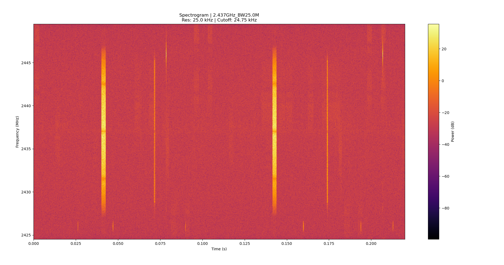

# Optimized Spectral Analysis of ISM Band Signals via SDR
---
## 1. Bluetooth Signal Analysis
**Center Frequency:** 2.472 GHz | **Bandwidth:** 20.0 MHz | **Dwell Time:** 0.06 s

### Time Domain Response

*Figure 1: Decimated time-domain amplitude*

### Spectrogram

*Figure 2: Spectrogram Bluetooth Hops*

---

## 2. Wi-Fi Signal Analysis
**A. Center Frequency:** 2.437 GHz | **Bandwidth:** 25.0 MHz | **Dwell Time:** 0.5 s
### Time Domain Response

*Figure 3: Decimated time-domain amplitude*
### Spectrogram

*Figure 5: Spectrogram Wi-Fi Bursts*

**B. Center Frequency:** 2.437 GHz | **Bandwidth:** 25.0 MHz | **Dwell Time:** 0.225 s
### Time Domain Response

*Figure 4: Decimated time-domain amplitude*
### Spectrogram

*Figure 6: Extended spectrogram view Wi-Fi Bursts*

---

